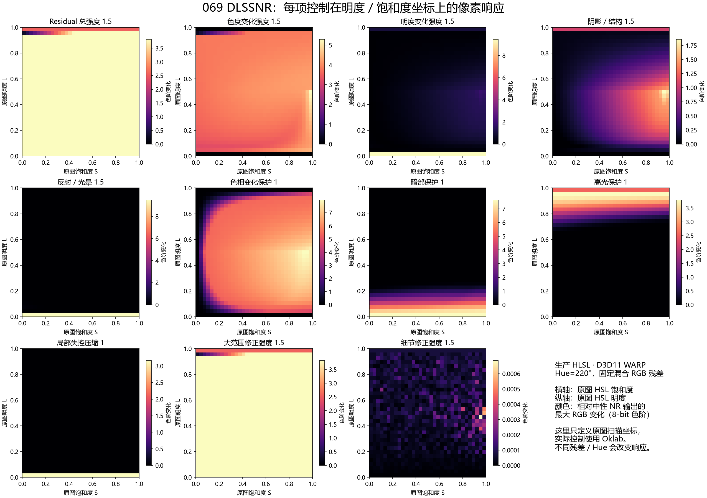
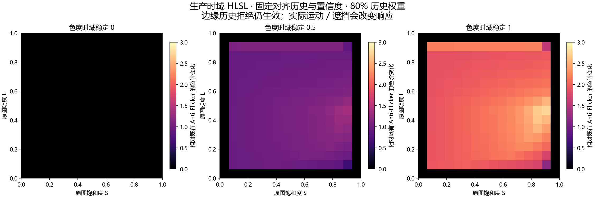

# 069 DLSSNR 细节控制：实施与验证

日期：2026-10-01。开发分支：`feature/069-dlssnr-detail-control`。主线：`experimental`；功能实现提交 `cf59602c`，合并提交 `b14569c5`。

本会话完成源码实现、必要自动测试及合并；合入当前工具栏／重复帧改造后再次通过参数／时域／真实 NGX 复验，捕获与输入历史修订规则保留。主线 DLSSNR 功能文件与验证分支逐文件一致；按用户要求不构建或部署新的 Release。069 beta1 产品编译部署、原生设置界面与真实静帧／视频画质验收交由独立会话。相关 [TODO](../todos/20261001-v0.6.9-dlssnr-detail-control-TODO.md) 保留这些未完成验收项。

## 实施范围

- 接入 `ee288e7d` 的集中 NR 资源链：最初推理尺寸输入 `L0` 与最后一次 NR 输出 `LN` 形成总残差，仅控制一次。原尺寸输入仍是最终基底。
- 新建效果显式保存 `residualColorMode=1`，使用 Oklab；导入／旧设置缺失模式键时写入 `0`，保留 Legacy HSL。用户可在「残差颜色模式」显式切换。原来的 S/L 键没有改名，模式定义其含义。
- 总强度范围改为 0–2；新模式的色度、明度、变暗与变亮修正各自独立。按 ΔL 正负只缩放明度标量，色度不随方向切换。分段形式是 C0 连续，零点左右斜率可以不同。
- 实现最终名称 **色相变化保护**、**局部失控压缩**，以及暗部／高光保护、大范围／细节修正和色度时域稳定。
- 正常输出的 alpha 保持原图；在启用 SDR 输入调整时，总强度 0／当前像素修正消失立即归零并拒绝该像素旧历史，包含 Legacy HSL 的新增 0 强度区间。未启用输入调整的历史路线维持原合同。
- 保护／进阶项在既有细节控制列按需展开，展开操作不清除历史或改变计算参数；隐藏值继续保存、复制、导入导出。色度时域稳定依赖 Anti-Flicker，关闭时禁用控件。补齐英文、简体与繁体标签、方向说明和效果目录。

## 算法与边界

SDR SRV 是普通 UNORM，先手动进行 sRGB 解码，再用 [Oklab 的 2021 矩阵](https://bottosson.github.io/posts/oklab/) 转换。总倍率继续先作用于存储 RGB 的差值。Oklab 模式保留超出 RGB 范围的候选，使用扩展传递函数和有符号立方根，避免在精调前丢失候选信息；Legacy HSL 保持其旧裁切方式。

色度按 a/b 笛卡尔向量计算，避免候选灰色的任意 Hue=0。色相保护将候选投影到原图色度方向，负径向截到原点；原图色度 0–0.02 的 smoothstep 连续淡出保护。明确有色区域的满保护不会因径向过冲反色，接近灰色时不宣称精确锁定不存在的色相。

暗部保护的原图 L 过渡为 0.08–0.35，高光为 0.72–0.98。高光保护结合原图 RGB 向外余量，变暗恢复使用较弱保护。掩码没有依赖受控输出反复分类。局部压缩按 Lab 残差幅度使用 0.04 软膝点，之后按 0.12 尺度渐进压缩，统一缩放向量；膝点下为恒等，膝点一阶导数匹配。

自动色域处理使用固定 L／色相方向的色度射线边界搜索，24 次二分；最终 RGBA8 范围保护保留 RGB clamp；升采样边缘过冲仍可能被裁切，因此低分辨率映射不能保证消除所有边缘偏色。与 [作者的色域映射讨论](https://bottosson.github.io/posts/gamutclipping/)方向一致，但实现采用明确的边界搜索，不宣称使用完整解析 cusp 算法。它是 C0 值连续映射，边界仍可能有斜率变化／色度平台。中性 NR 候选在色域内走精确快速路径，略偏离中性时只产生有界往返误差。

频率控制在受控的有符号 RGB 残差上用半径 1 的 3×3 引导滤波分出 low，high 为精确互补；引导使用原图存储 RGB，空间权重为 1/2/1，颜色距离指数尺度 0.005。两个增益为 1 时绕过全部邻域采样。非默认值增加一个 prepare dispatch 内的计算，不新增 NR／光流链、dispatch 或纹理；最坏路径可能为 9 个像素执行颜色控制，实际成本仍需测量。

色度时域稳定复用现有 RGB FP16 历史、运动、有效区域、补丁置信度与拒绝逻辑。在既有 luma 结果上增强 Lab chroma 历史混合，参数 0 不增加色度稳定。SDR 控制输出归零时清除当前像素历史；参数、尺寸、次数、捕获重置和失败沿用重置合同。HDR 不启用新色度控制。

「残差诊断视图」提供最终图、原始／受控总残差、ΔL、色度变化、保护权重、色域比例、局部压缩比例。显示值经残差重建路径升采样，直接显示诊断颜色，避免原尺寸基底污染权重图；alpha 仍来自原图。诊断期间旁路输出抗闪烁，不改变 NR 历史；进入／退出视图清除输出历史。原始残差图为 `.5 + 4*delta`，权重图 1 为未压缩／未保护。

## 精度、抖动与升采样的选择

SDR 捕获／下采样／共享 NR 输入与输出仍为 RGBA8，受控与水平残差为有符号 FP16，最终输出 RGBA8。HDR 是现有独立 FP16 合同，不能据此证明 SDR NGX 资源可以全部改为 FP16。本次没有改变共享格式或模型入口。

[离线采样比较](assets/dlssnr-detail/sampling-evaluation.json)中，0→0.05 残差阶跃的 Catmull-Rom 过冲约 0.94444 个 8-bit 色阶；线性插值无该过冲，但需要实际图像比较其软化代价。因此保留既有 Catmull-Rom，不把算法改变混入资源等价重构。边缘感知插值与范围限制保留为实际内容 A/B 项。

静止 4×4 Bayer 抖动在量化前零均值；合成渐变的量化 RMS 误差从 0.28853 增到 0.40780 个色阶。抖动可以改变误差空间分布，但这不证明感知改善；早期 RGBA8 和后续效果的再次量化仍存在。当前默认不加入噪点，真实静帧／视频比较后再决定是否启用自动抖动。首轮也不新增独立高饱和保护滑块；色域射线与高光保护先处理输出余量，实际强彩色光源 A/B 仍需完成。

## 验证结果

| 检查 | 结果与证据边界 |
| --- | --- |
| 实际生产 HLSL 严格编译 | 转换、颜色下采样两方向、引导下采样、prepare、水平升采样、最终合成，以及两条时域 shader 通过；warnings-as-errors |
| 灰轴连续性 | HSL 复现旧跳跃；Oklab float 最大相邻 RGB 变化 7.21216e-6，约 0.00184 个色阶；FP16 最大相邻变化 0.00012207，约 0.03113 个色阶 |
| ΔL 过零 | CPU 独立二分确定 G≈0.392487 的 Oklab 零点；生产 shader 最大相邻变化 1.93715e-6 |
| 滑块边界 | 11 个增益／保护控制，含 0、0.04、0.5、1、1.5、2 及越界候选；±1e-5 探针最大变化 9.29832e-6，约 0.00237 个色阶 |
| 独立 CPU 坐标对照 | double 矩阵计算的灰轴输出与生产 float 输出约 `(0.393441,0.500463,0.698694)` 一致，误差低于 2e-5 |
| 零／默认／频率／色域 | 总倍率 0、零残差、中性与近中性、满色相保护跨原点、随机极暗／极亮／强修正、恒定与交替残差的互补分解、强引导边界防泄漏通过 |
| 参数与配置 | 44 个键，真实 parser、缺失／非有限值、旧／新模式初始化、隐藏保存与条件可用性、NR 参数修订隔离通过；resample cbuffer 80 字节与 8 个新增字段偏移经 shader reflection 核对 |
| 时域 | 四条生产 HLSL 路线回归通过，新增零残差清除和色度混合／拒绝通过；WARP D3D11 调试层无警告 |
| 当前 C++ 源码 | 原生 Temporal／Factory 与 UI ScalingModeItem／ScalingModesService 使用已有依赖 MSVC `/Zs /WX` 通过；没有产品构建输出 |
| 真实 GPU／NGX | RTX 5070 Ti，驱动 32.0.16.1692（616.92），NR DLL 310.8.0.0（SHA256 `984BEE0F775C277D5829B8FD6775D53A7B0F75396C852B3AAF06A18375F81014`）；45 组基础链配置（RGBA／BGRA、调整关闭／25／67／100%、HDR、1→2→3→2→1）；当前生产后端编译进测试程序，新增保护／压缩／频率／视图实时更新没有额外 NR Evaluate，总强度 0 回原图，D3D11／D3D12 调试层无警告 |
| 资源回归 | 生产重建的 direct／copied 输出 25 组一致、别名回退及 FG 持久 readback 96 次提交在 timing 开关两种配置下通过；旧提取器已跟随新 shader 片段／常量更新 |
| 效果目录 | 162 个源效果／目录条目，生成一致性及两种目录语言完整性通过 |

WARP 与 CPU 数值不代表真实视频画质。真实 NGX 冒烟使用合成输入和固定引导，不代表实际捕获、AMDOF／NVOF、肤色／天空／字幕／运动 A/B 或 FPS 收益。1×1 等小尺寸仅验证 shader 重建，不代表 NGX 支持对应推理尺寸。

## 坐标轴响应

[生产 response CSV](assets/dlssnr-detail/detail-response.csv) 和 [数值边界结果](assets/dlssnr-detail/detail-results.json)均由生产 shader 测试导出。单项图固定 Hue=220°，原图 HSL L/S 作为输入扫描坐标；NR 候选采用固定混合 RGB 差值，颜色表示相对中性输出的最大 RGB 变化。输入轴不是 Oklab 的掩码权重，也不能单独决定真实输出。



该样例的残差主要为低频，细节增益图接近数值误差级。另用交替残差验证了高频控制，不能将图中的近零响应理解为控件无效。保护 0／增益 1 的组合与滑块交互另有直接 shader 测试。

色度时域控制还依赖历史、运动与拒绝，使用 [固定对齐历史的独立 CSV](assets/dlssnr-detail/temporal-response.csv)；图中边缘拒绝仍生效，0 强度严格为零附加作用。



## 复验与交接

```powershell
pwsh -NoProfile -File tests/Run-DLSSNRDetailTests.ps1
pwsh -NoProfile -File tests/Run-DLSSNRTemporalTests.ps1
pwsh -NoProfile -File tests/Run-DLSSNRMultiPassTests.ps1
pwsh -NoProfile -File tests/Run-DlssR2ResourceTests.ps1
pwsh -NoProfile -File tests/Validate-EffectCatalog.ps1
# 仅使用已有依赖做语法检查／编译测试程序，不构建产品：
pwsh -NoProfile -File tests/Check-DLSSNRDetailSources.ps1 -BuildRoot <existing-build-root>
pwsh -NoProfile -File tests/Run-DLSSNRPipelineTests.ps1 -BuildRoot <existing-build-root>
```

beta1 会话需编译最新 `experimental` 的全部项目及资源，检查原生参数面板、DPI／多显示器、保存／恢复／复制／导入导出 UI，以及真实内容与性能。评估 HDR FP16 扩展、独立高饱和保护、抖动或新插值时单列画质变化；不能据本次合成测试宣称其已验收。
